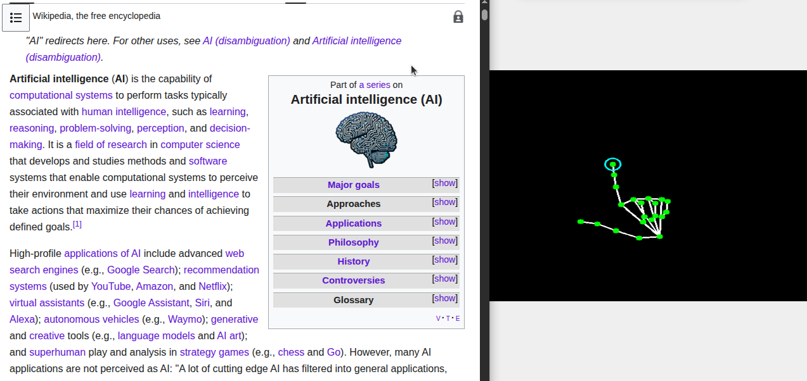
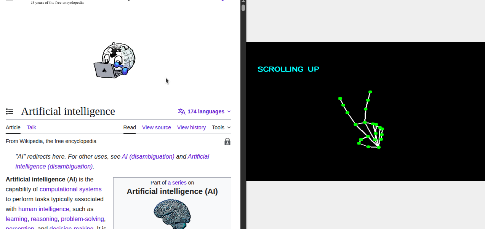
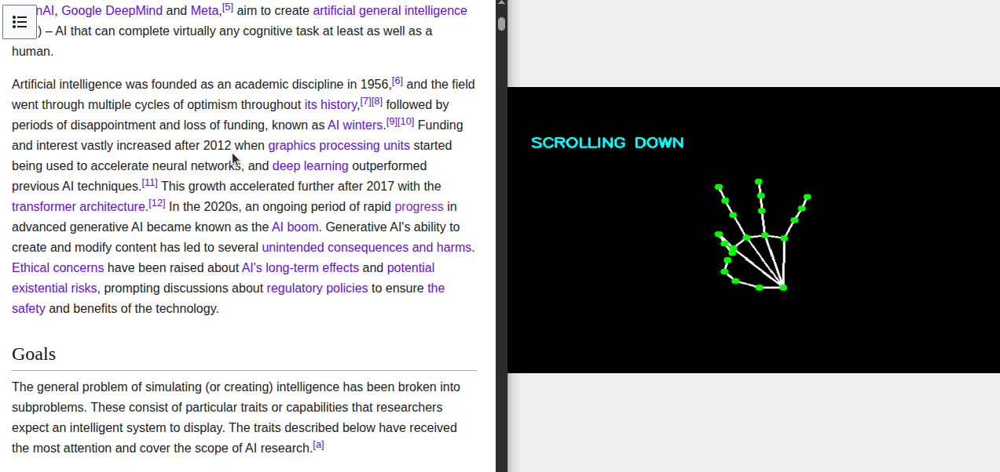
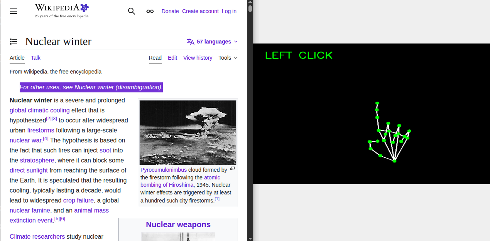
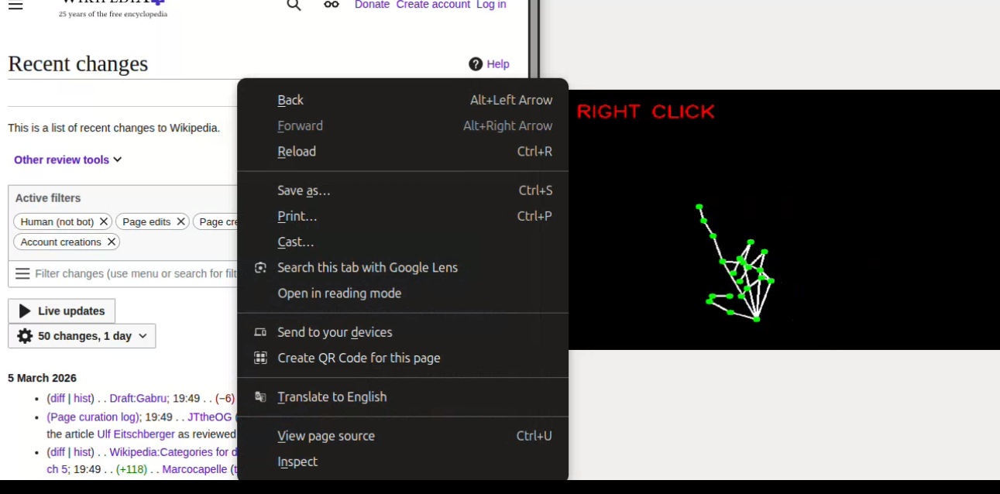

# 🖱️ AI Virtual Mouse using Hand Gestures

Control your computer using hand gestures without ever exposing your face or background. 

This project features a **Privacy-First Logic View**: instead of showing a raw webcam feed, it projects detected hand landmarks onto a generated black canvas.

This project uses **MediaPipe Hand Landmarker (Tasks API)** and **OpenCV** to detect 21 hand landmarks and convert specific gestures into real mouse actions like:

- Cursor movement
- Left click
- Right click
- Scroll up / down

---

## 🚀 Features

- ✋ Real-time 21 hand landmark detection
- 🖱️ Smooth cursor control using Exponential Moving Average (EMA)
- 👆 Gesture-based clicking via pinch detection
- 🔄 Scroll control using finger combinations
- 🎯 Click cooldown protection
- 📐 Frame boundary mapping for accurate screen coverage- 
- 🧠 Modular architecture (clean separation of logic)

---

## 🧠 How It Works

- 1️⃣ OpenCV captures webcam frames.
- 2️⃣ MediaPipe detects 21 hand landmarks per hand.
- 3️⃣ Finger states (up/down) are calculated by comparing tip and joint positions.
- 4️⃣ Pinch distances are measured using Euclidean distance.
- 5️⃣ Cursor coordinates are mapped from camera space → screen space.
- 6️⃣ Cursor movement is smoothed using Exponential Moving Average (EMA).
- 7️⃣ PyAutoGUI sends mouse commands to the OS.

---

## 🎯 EMA Smoothing

Cursor movement uses Exponential Moving Average (EMA) smoothing:

```python
current_position = previous + (target - previous) * SMOOTHING_FACTOR
```
### Benefits:

- Reduces hand jitter
- Improves precision
- Creates natural motion feel

 ---

 ## 🛡️ Privacy & Security

- **No Background Capture:** The system extracts hand landmarks and discards the raw image frames immediately.
- **Local Processing:** All AI inference happens on your machine; no data is sent to the cloud.
- **Black Canvas Mode:** Ideal for screen-sharing or recording demos where you don't want your room visible.

---

## ✋ Gesture Controls

| Gesture | Action |
|----------|--------|
| Index finger up | Move cursor |
| Thumb + Middle (pinch) | Left Click |
| Thumb + Pinky (pinch) | Right Click |
| Index + Middle up | Scroll Up |
| Middle + Ring + Pinky  up | Scroll Down |

---

## 📁 Project Structure

```text
virtual-mouse/
│
├── main.py
├── config.py
├── gesture_logic.py
├── cursor_control.py
├── hand_tracker.py
├── models/
│ └── hand_landmarker.task
├── requirements.txt
└── README.md
```

## 🛠️ Troubleshooting (Linux/Ubuntu)

- **ModuleNotFoundError (cv2/mediapipe):** Ensure you are running the script using the environment's python:
  `./vision_env/bin/python3 main.py`
- **Externally Managed Environment:** If `pip install` fails, use the absolute path to the venv pip:
  `./vision_env/bin/pip install -r requirements.txt`
- **Missing GUI Dependencies:** If the window doesn't open, run:
  `sudo apt update && sudo apt install libgl1-mesa-glx libglib2.0-0`

## 🛠️ Installation

### 1️⃣ Clone Repository

```bash
git clone https://github.com/Hanan-Abbas/virtual-mouse.git

cd virtual-mouse
```

### 2️⃣ Create Virtual Environment (Recommended)

```bash
python3 -m venv vision_env
source vision_env/bin/activate
```

### 3️⃣ Install Dependencies

```bash
./vision_env/bin/pip install -r requirements.txt
```
### 4️⃣ Download MediaPipe Model

Download:

`hand_landmarker.task`


From MediaPipe official site and place it inside: models/

- Link: 
https://storage.googleapis.com/mediapipe-models/hand_landmarker/hand_landmarker/float16/1/hand_landmarker.task


---

## ▶️ Run the Project

```bash
python3 main.py
```

---

## ⚙️ Configuration

You can modify sensitivity and behavior inside:

config.py


- `SMOOTHING_FACTOR`
- `CLICK_THRESHOLD`
- `FRAME_REDUCTION`
- `SCROLL_SENSITIVITY`

---

## 📈 Future Improvements

- Add multi-hand support
- Add gesture calibration mode
- Add GUI settings panel
- Add FPS counter
- Add gesture customization
- Add machine learning gesture classifier

---

## 🖼️ Logic View Gallery (Static Demo)

Since this project prioritizes privacy, the "Logic View" provides high-contrast visual feedback of the AI's tracking without capturing your personal environment.

| 1. Cursor Moving | 2. Scroll Up | 3. Scroll Down |
| :---: | :---: | :---: |
|  |  |  |
| *Index finger navigation* | *Index + Middle fingers up* | *Middle + Ring + Pinky up* |

| 4. Left Click | 5. Right Click |
| :---: | :---: |
|  |  |
| *Thumb + Middle pinch* | *Thumb + Pinky pinch* |


## 🧩 Technologies Used

- Python
- OpenCV
- MediaPipe Tasks API
- PyAutoGUI
- NumPy

---

## ⚠️ Disclaimer

This project directly controls your mouse.
Move your hand slowly while testing.

PyAutoGUI failsafe is enabled — move cursor to top-left corner to stop control if needed.

---

## 👨‍💻 Author

Hanan Abbas  
AI / Computer Vision Enthusiast  

---

## ⭐ If you found this useful

Give it a star ⭐ on GitHub.
